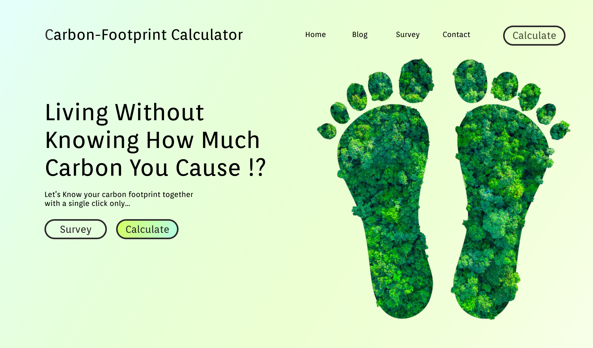

# Carbon Footprint Calculator Web App

## Overview

This web application, built using React, is designed to calculate the carbon footprint of an individual or family. It provides users with a user-friendly interface to input various lifestyle choices and habits, and then calculates the corresponding carbon footprint based on environmental impact factors.

## Features

- **Lifestyle Input Form**: Allows users to input information about their daily habits, transportation choices, energy consumption, and more.

- **Carbon Footprint Calculation**: Utilizes a calculation algorithm to estimate the user's carbon footprint based on their inputs.

- **Visual Representation**: Displays the calculated carbon footprint in an easy-to-understand format.

<!-- - **Tips and Suggestions**: Provides users with eco-friendly tips and suggestions to reduce their carbon footprint. -->

## Requirements

Make sure you have the following tools installed:

- `Node.js`: Make sure you have Node.js installed. You can download it from [nodejs.org](https://nodejs.org/).

- `npm`: Node Package Manager is usually included with Node.js.

## Preview


  
## Website Link

- [calculate-carbon-footprint](https://calculate-carbon-footprint.netlify.app/)

## Usage

1. Clone the repository:

```bash
git clone https://github.com/meeyth/Carbon-Footprint-calculator.git
cd carbon-footprint-calculator
